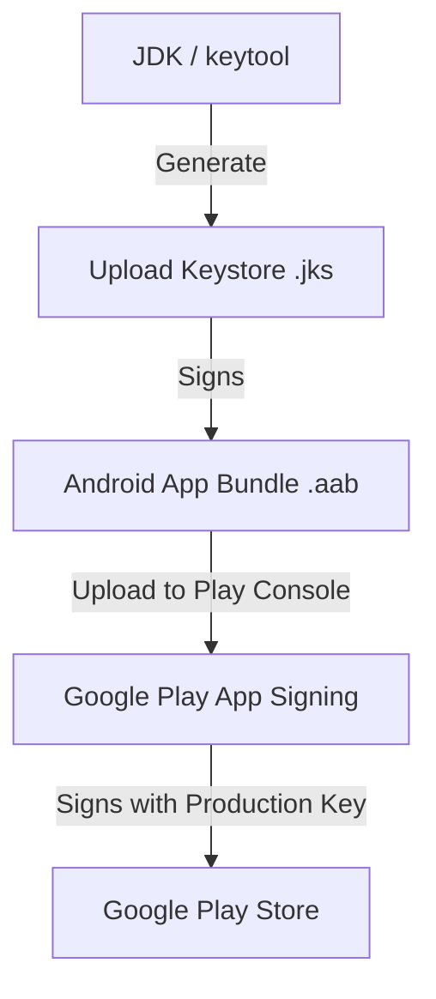

# Android Code Signing: Keystores, Play Console, and Review Policies

This guide provides a comprehensive playbook for managing Android signing keystores, Google Play Console setups, automated submissions, and store review policies to successfully publish your React Native app.

---

## 1. How Android Code Signing Works

Unlike iOS, which uses centralized certificate authorities managed by Apple, Android relies on developer-generated cryptographic keys.



### Google Play App Signing (Recommended)
Historically, developers signed app binaries directly with their final release key. If this key was lost, you could never update your app again. Modern industry standard is to use **Google Play App Signing**:
1. You generate an **Upload Keystore** to sign your binaries locally or on CI/CD (EAS).
2. Google Play receives the uploaded AAB, decrypts it, and re-signs it with your secure **App Signing Key** managed by Google.

---

## 2. Generating and Managing a Keystore (.jks)

The Keystore is a binary file containing your private key and certificates.

### How to Generate a Keystore Manually:
Run the standard Java `keytool` utility in your terminal:
```bash
keytool -genkeypair -v \
  -keystore my-upload-key.keystore \
  -alias my-key-alias \
  -keyalg RSA \
  -keysize 2048 \
  -validity 10000
```
This utility will prompt you for keystore passwords, key alias passwords, and organizational details. 

> [!CRITICAL]
> **Store passwords and keys securely.** If you are not using Google Play App Signing, losing your release keystore means you will lose the ability to update your application forever.

---

## 3. Play Console Setup & API Integration

To distribute your app, you must configure a Google Play Console Developer Account and link automated API keys for submission:

### Step 1: Create the Play Console App
1. Log in to [Google Play Console](https://play.google.com/console/).
2. Click **Create app**.
3. Fill in:
   * **App Name** (e.g. `ReactNativeAppProduction`).
   * **Default language**.
   * **App or game** (Select App).
   * **Free or paid** (Select Free).
4. Agree to developer policies and terms, then click **Create app**.

### Step 2: Configure Service Account API Access (For EAS Submit)
To allow GitHub Actions/EAS to upload build binaries automatically:
1. Open the [Google Cloud Console](https://console.cloud.google.com/).
2. Select your Google Cloud project linked with your Google Play Console developer account.
3. Navigate to **IAM & Admin > Service Accounts** and click **Create Service Account**.
4. Name the account (e.g. `eas-publisher`), grant **Service Account User** access.
5. Create a **JSON Key** for this account and download it.
6. Return to Google Play Console, go to **Users and permissions > Service Accounts**, click **Invite new user**, enter the service account's email, and grant **Release Manager** access.

---

## 4. Understanding Release Tracks

Google Play categorizes releases into four distinct tracks:

1. **Internal Testing**: Fast distribution to up to 100 internal testers. Downloads are available almost instantly without Google review.
2. **Closed Testing (Alpha/Beta)**: Testing with specified email groups. Requires a standard Google review before becoming active.
3. **Open Testing**: Public beta releases. Anyone can join, requires Google review.
4. **Production**: The final release available to all users worldwide in the Google Play Store.

---

## 5. Google Play Review Policies & Rejection Prevention

To pass the Google Play review process without rejections, you must configure policies and declarations:

### Key Policies to Configure:
* **Privacy Policy**: Provide a valid public URL to your App Privacy Policy.
* **Data Safety**: Declare what user data your app collects (e.g., location, email, device IDs) and how it is encrypted/stored.
* **Sensitive Permissions (e.g., Location/Camera)**:
  * If your app requests background location access (`ACCESS_BACKGROUND_LOCATION`), you must submit a declaration video showing why background location is required for core features.
  * Avoid requesting broad permissions you do not actively use (e.g., do not request `READ_EXTERNAL_STORAGE` if you do not read user files).
* **Target Audience**: Declare the age group of your users. Apps targeting children under 13 have strict compliance checks (COPPA).
* **App Access**: Provide active test credentials (login username and password) if your app requires authentication, so Google reviewers can log in.

---

## 6. Automating the Setup via Expo EAS

Instead of managing keystores and configurations manually, let Expo EAS handle it:

```bash
eas credentials --platform android
```
Choose **production**. EAS will generate an Upload Keystore, link it to your app's Expo profile, and manage it securely in the cloud.

Configure auto-submission configurations by linking your Google Service Account key:
```bash
eas submit:configure --platform android
```
Select the downloaded **Service Account JSON key file**.
