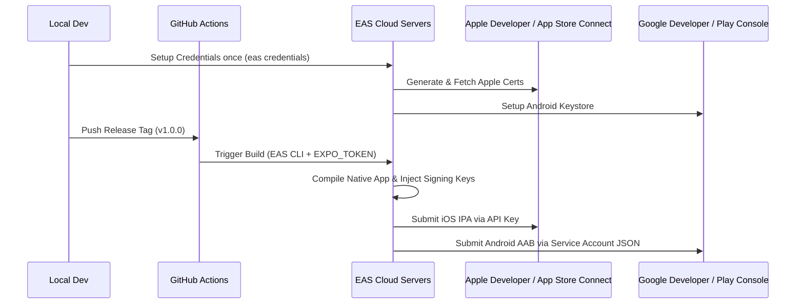

# Automated Builds, Code Signing, and Store Submission Guide

This guide details the step-by-step process for configuring automated cloud builds, secure code signing certificates, and automated store submissions for iOS (Apple App Store) and Android (Google Play Store) using **Expo EAS (Expo Application Services)**.

---

## 1. Overview of Automated Signing and Deployment

To run a fully automated pipeline, Expo EAS acts as the secure builder and custodian of credentials. The code signing and store uploads happen in the cloud:



---

## 2. Android Setup: Code Signing & Play Store Submissions

To allow EAS to sign your Android build (`.aab` / `.apk`) and automatically submit it to Google Play Console:

### Step 1: Set Up Code Signing Credentials
EAS can automatically generate a secure Android Keystore for your application:
```bash
eas credentials --platform android
```
Select **production** profile, and choose **"Let EAS generate a new keystore"** (or upload an existing keystore if you are migrating an existing app). EAS securely stores this keystore inside your Expo account dashboard.

### Step 2: Set Up Google Play Console API Access
To enable automatic deployments (`--auto-submit`), EAS must have permission to upload builds to the Google Play Store on your behalf:
1. Open the [Google Cloud Console](https://console.cloud.google.com/).
2. Select your Google Cloud project linked with your Google Play Console developer account.
3. Navigate to **IAM & Admin > Service Accounts** and click **Create Service Account**.
4. Name the service account (e.g., `eas-store-publisher`), and assign the Role **Service Account User** (or Editor).
5. After creation, select the Service Account, go to the **Keys** tab, click **Add Key > Create New Key**, select **JSON**, and download the file. Keep this file secure.
6. Open your **Google Play Console**, navigate to **Users and permissions > Service Accounts**, click **Invite new user**, enter the service account's email, and grant **Release Manager** permissions (including editing releases, draft app releases, and managing testing tracks).

### Step 3: Link the Google Play Service Account to EAS
Bind the downloaded Google JSON key to your EAS configuration:
```bash
eas submit:configure --platform android
```
Choose the path to your downloaded Service Account JSON key. EAS will upload and map it to your app's production profile.

---

## 3. iOS Setup: Code Signing & App Store Submissions

To sign and submit iOS apps (`.ipa`) automatically to Apple TestFlight and the App Store:

### Step 1: Manage Apple Credentials & Provisioning
Run the credentials configuration wizard locally:
```bash
eas credentials --platform ios
```
Choose **production** credentials. EAS will prompt you to log into your Apple Developer Portal. It will automatically generate and manage:
* **Apple Distribution Certificate**: To sign code for the App Store.
* **App ID & Entitlements**: Automatically mapped from `app.json`.
* **Provisioning Profile**: Binds the App ID and certificates.

### Step 2: Configure App Store Connect API Key (For Submissions)
To bypass Apple 2-Factor Authentication (2FA) prompts during automated builds in GitHub Actions, you must generate an App Store Connect API Key:
1. Log in to [App Store Connect](https://appstoreconnect.apple.com/).
2. Navigate to **Users and Access > Keys**.
3. Click **Add (+)** to create a new API Key:
   * Name: `EAS Build Submit`
   * Access: **Developer** or **App Manager**
4. Copy the **Issuer ID** and **Key ID**.
5. Download the Private Key file (`.p8`). *Note: You can only download this key once.*

### Step 3: Link the API Key to EAS Submit
Configure Apple submission credentials on EAS:
```bash
eas submit:configure --platform ios
```
Enter the requested details:
* **Key ID**
* **Issuer ID**
* **Path to the `.p8` private key file**

---

## 4. EAS Build Configurations (`eas.json`)

Ensure that your `eas.json` file is correctly configured to separate builds for internal testing, store validation, and store submissions:

```json
{
  "cli": {
    "version": ">= 9.0.0"
  },
  "build": {
    "development": {
      "developmentClient": true,
      "distribution": "internal"
    },
    "preview": {
      "distribution": "internal",
      "channel": "preview"
    },
    "production": {
      "channel": "production"
    }
  },
  "submit": {
    "production": {}
  }
}
```

* **development**: Installs the `expo-dev-client` shell allowing live coding and local metro hosting.
* **preview**: Builds an ad-hoc or internal app bundle to distribute to testers before launching to stores.
* **production**: Creates the optimized final distribution build, matching code-signing profiles for Google Play and App Store distribution.

---

## 5. Security & Best Practices

1. **Keep Secrets Secure**: Never commit `.p8` files, keystores, or service account JSON files to your Git repository. EAS stores these securely in their credentials database.
2. **Use Expo Access Tokens**: On GitHub Actions, only expose the `EXPO_TOKEN` secret. This allows the runner to authenticate with EAS, access the secure cloud-stored credentials, and run builds.
3. **Internal Distribution**: To distribute beta builds quickly without uploading to TestFlight/Google Play console immediately, use EAS **Internal Distribution** (which builds an Ad-Hoc provisioning profile containing register developer devices UDIDs).
