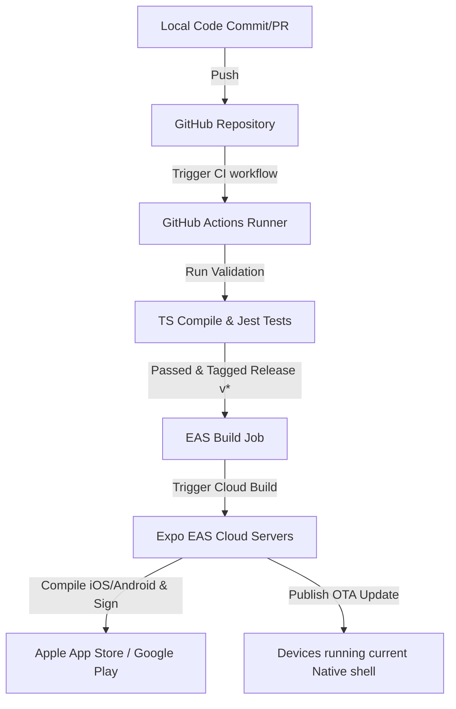

# React Native Production CI/CD Setup Guide (GitHub Actions & Expo EAS)

This guide documents the complete step-by-step process to set up a fully automated, industry-standard Continuous Integration (CI) and Continuous Delivery (CD) pipeline using **GitHub Actions** and **Expo EAS (Expo Application Services)**.

---

## 1. Architecture Overview



---

## 2. Local Setup & EAS Configuration

Before configuring GitHub Actions, EAS must be set up locally.

### Step 1: Install EAS CLI Globally
```bash
npm install -g eas-cli
```

### Step 2: Login to your Expo Account
```bash
eas login
```

### Step 3: Initialize EAS in your Project
Ensure you run this command at the root of the project:
```bash
eas project:init
```
This registers the application with your Expo dashboard and generates an `eas.json` configuration file.

### Step 4: Configure `eas.json`
Your `eas.json` should have clear profiles for development, preview, and production:

```json
{
  "cli": {
    "version": ">= 9.0.0"
  },
  "build": {
    "development": {
      "developmentClient": true,
      "distribution": "internal"
    },
    "preview": {
      "distribution": "internal",
      "channel": "preview"
    },
    "production": {
      "channel": "production"
    }
  },
  "submit": {
    "production": {}
  }
}
```

---

## 3. GitHub Actions CI/CD Pipeline Config

The CI/CD pipeline is defined in [ci.yml](file:///Users/ajay/Documents/ReactNativeAppProduction/.github/workflows/ci.yml). It has two main jobs:
1. **validate**: Run on all pushes and pull requests to the `main` branch to guarantee lint/compile validity and test compliance.
2. **deploy**: Triggered only when a release version tag (e.g. `v1.2.3`) is pushed. This builds and auto-submits the app to the app stores.

### Full Pipeline Workflow Code:
```yaml
name: CI/CD Pipeline

on:
  push:
    branches: [ main ]
    tags:
      - 'v*'
  pull_request:
    branches: [ main ]

jobs:
  validate:
    runs-on: ubuntu-latest

    steps:
      - name: Checkout Code
        uses: actions/checkout@v4

      - name: Setup Node.js
        uses: actions/setup-node@v4
        with:
          node-version: 20
          cache: 'npm'

      - name: Install Dependencies
        run: npm install --legacy-peer-deps

      - name: Run TypeScript Compile Check
        run: npx tsc --noEmit -p apps/app/tsconfig.json

      - name: Run Jest Test Suite
        run: npm test

  deploy:
    name: EAS Build & Submit
    needs: validate
    if: startsWith(github.ref, 'refs/tags/v')
    runs-on: ubuntu-latest
    steps:
      - name: Checkout Code
        uses: actions/checkout@v4

      - name: Setup Node.js
        uses: actions/setup-node@v4
        with:
          node-version: 20
          cache: 'npm'

      - name: Install EAS CLI
        run: npm install -g eas-cli

      - name: Install Dependencies
        run: npm install --legacy-peer-deps

      - name: Build & Submit Android to Play Store
        run: eas build --platform android --profile production --non-interactive --auto-submit
        env:
          EXPO_TOKEN: ${{ secrets.EXPO_TOKEN }}

      - name: Build & Submit iOS to App Store
        run: eas build --platform ios --profile production --non-interactive --auto-submit
        env:
          EXPO_TOKEN: ${{ secrets.EXPO_TOKEN }}
```

---

## 4. Connecting Credentials and Secrets

For the deployment stage to run successfully, EAS needs credentials to sign your builds and submit them.

### Step 1: Link Expo Account Token to GitHub
1. Navigate to your [Expo Access Tokens](https://expo.dev/settings/access-tokens) page.
2. Click **Create Token** (provide a descriptive name like "GitHub Actions CD").
3. Copy the token.
4. Open your GitHub Repository settings, go to **Settings > Secrets and variables > Actions**.
5. Click **New repository secret**.
6. Set Name to `EXPO_TOKEN` and paste the token as the Value.

### Step 2: iOS & Android Credentials setup in EAS
1. **iOS Provisioning**: Run the following command locally once to set up Apple credentials:
   ```bash
   eas credentials:run --platform ios
   ```
   Follow the prompts to log in to your Apple Developer account. EAS will automatically generate and manage the distribution certificate and provisioning profile in the cloud.
2. **Android Keystore**: Run:
   ```bash
   eas credentials:run --platform android
   ```
   EAS will generate a new keystore or allow you to import an existing one to sign the release AAB/APK.

---

## 5. Deployment and Submission Steps

To trigger a production release build and auto-submission to Google Play and Apple App Store, execute the following steps locally:

1. **Commit and push all changes**: Ensure the workspace is clean and committed.
2. **Create a version tag**:
   ```bash
   git tag v1.0.0
   ```
3. **Push the tag to GitHub**:
   ```bash
   git push origin v1.0.0
   ```
This triggers the `deploy` job on GitHub Actions, which invokes EAS Cloud Build to compile, sign, and upload the build binaries to Apple TestFlight/Google Play Console directly.

---

## 6. Over-the-Air (OTA) Updates & Rollbacks

EAS Update allows you to bypass app store review times by delivering instant patches (bug fixes/UI tweaks) to users' devices.

### Publishing an Update
To deploy JavaScript updates instantly to the `production` channel:
```bash
npx eas update --branch production --message "Fix critical dashboard checkout crash"
```

### Rollback Strategy (Instant Recovery)
If an update introduces a regression, you can rollback immediately to a previous stable state:

1. **EAS Rollback Command**:
   ```bash
   npx eas update:rollback --channel production
   ```
   Follow the CLI prompts to select the last known stable update publish ID.
2. **Alternative Git Rollback**:
   Checkout the last stable git commit, and re-publish the stable JavaScript bundle:
   ```bash
   git checkout tags/v0.9.9
   npx eas update --branch production --message "Reverted to stable version v0.9.9"
   ```
This redirects active user devices to the working stable code on their next app restart (or instantly, depending on your OTA update policy configuration in `app.json`).
