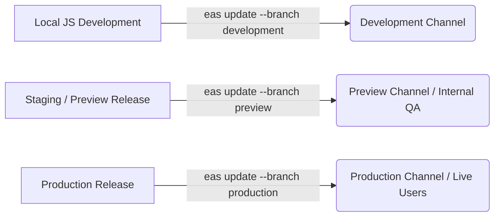

# EAS Update Rollout & Rollback Strategies Playbook

This document details the strategies and best practices for managing Over-The-Air (OTA) updates using **Expo EAS Update**. It ensures that hotfixes, UI tweaks, and JS/asset updates are distributed safely, tested thoroughly, and can be rolled back immediately if any bugs occur.

---

## 1. Core Concepts: Native Runtimes vs. JS Bundles

An Expo/React Native application consists of two main parts:
1. **Native Shell**: The compiled binaries (`.ipa`/`.apk`) containing iOS/Android compiled code, native libraries, and the React Native engine.
2. **JS Bundle & Assets**: The JavaScript code, stylesheet styling, images, and fonts that run inside the native shell.

EAS Update allows you to update the **JS Bundle & Assets** instantly without submitting a new binary to the App Stores.

> [!CRITICAL]
> **The Golden Rule of EAS Update:** An OTA update will only be delivered to devices running a native shell that matches the update's `runtimeVersion` exactly. Sending an update with incompatible native modules will crash the application.

---

## 2. Environment & Channel Architecture

To ensure stability, we enforce a strict separation of updates between environment channels:



| Channel Name | Linked Git Branch | Target Audience | Usage |
| :--- | :--- | :--- | :--- |
| `development` | `dev` | Developers | Live testing of JS code on simulator/physical dev clients. |
| `preview` | `staging` | Internal QA / Clients | Release-candidate testing via internal distribution builds. |
| `production` | `main` | Production Users | General public App Store and Google Play installs. |

---

## 3. Runtime Versioning Strategy

To prevent mismatch crashes, define the `runtimeVersion` in your `app.json` configuration.

### Policy Recommendation: App Version Alignment
Aligning your runtime version directly to the major and minor app versions ensures updates are only loaded by compatible apps:

```json
{
  "expo": {
    "name": "ReactNativeAppProduction",
    "version": "1.0.0",
    "runtimeVersion": {
      "policy": "appVersion"
    }
  }
}
```
* Using `"policy": "appVersion"` tells EAS that any native change (which changes the version from `1.0.0` to `1.1.0` in `app.json`) creates a new native runtime.
* Devices running `1.0.0` will **never** download updates meant for `1.1.0`.

---

## 4. Step-by-Step Rollout Strategy (Staging to Production)

Never publish an OTA update directly to the production channel without validation:

### Step 1: Push Update to Preview Branch
Publish the JS patch to the `preview` branch for verification:
```bash
npx eas update --branch preview --message "Release candidate patch for checkout page UI"
```

### Step 2: Internal Verification
Testers run the `preview` build on their devices. The preview build automatically fetches updates from the `preview` channel. Verify:
* App launches successfully without crashing.
* The new JS patch behaves correctly.
* Performance and rendering remain optimized.

### Step 3: Promote to Production Channel
Once QA signs off on the preview build, deploy the identical commit to the production channel:
```bash
npx eas update --branch production --message "Deploy checkout page UI hotfix to production"
```

---

## 5. Instant Rollback & Recovery Procedures

If a critical bug bypasses QA and enters production, use one of the following methods to recover immediately.

### Method A: EAS CLI Instant Rollback (Recommended)
This points your production channel back to a previous known stable update bundle instantly:

1. **Trigger Rollback**:
   ```bash
   npx eas update:rollback --channel production
   ```
2. **Confirm Target**:
   Select the last stable update ID from the interactive list.
3. **Outcome**:
   Active devices will download and run the reverted bundle on their next app launch, neutralizing the bug within seconds.

### Method B: Git-Based Redeployment Rollback
If you need to make structural edits or revert to a specific git commit:

1. **Revert local workspace to stable tag**:
   ```bash
   git checkout tags/v1.0.1
   ```
2. **Republish the stable bundle**:
   ```bash
   npx eas update --branch production --message "Reverting JS bundle to stable v1.0.1"
   ```
3. **Return to main branch**:
   ```bash
   git checkout main
   ```

---

## 6. Native vs. Over-the-Air Update Rules

Before releasing an update, determine whether it can be sent via EAS Update or requires a full App Store release:

| Modification Type | OTA (EAS Update) | Full App Store Release | Reason |
| :--- | :---: | :---: | :--- |
| **JS Code / Logic Changes** | ✅ Yes | Optional | Standard JavaScript compilation logic. |
| **CSS Styles / UI Colors** | ✅ Yes | Optional | Statically loaded asset changes. |
| **Asset Files (Images/Fonts)** | ✅ Yes | Optional | Automatically bundled and uploaded. |
| **New Native Package (`package.json`)** | ❌ No | ⚠️ YES | Requires compilation of native binary. |
| **Config Changes (`app.json` / iOS / Android folders)** | ❌ No | ⚠️ YES | Modifies native layout or properties. |
| **SDK / React Native Upgrade** | ❌ No | ⚠️ YES | Modifies underlying engine runtimes. |
