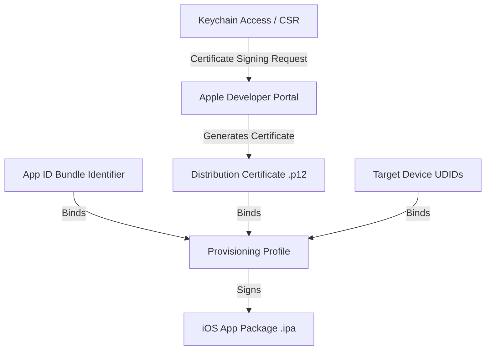

# iOS Code Signing: Certificates, Provisioning Profiles, and App Store Connect

This guide provides a comprehensive walkthrough for configuring Apple iOS code-signing certificates, identifiers, provisioning profiles, and App Store Connect credentials to distribute your React Native app.

---

## 1. How iOS Code Signing Works

Apple enforces strict security boundaries on iOS. To run your app on a physical device or submit it to the App Store, the code must be cryptographically signed by a trusted developer certificate.



---

## 2. Managing iOS Certificates (.p12)

Certificates verify your identity as an Apple developer. There are two primary types:
* **Apple Development Certificate**: Used to run debug builds locally on physical test devices.
* **Apple Distribution Certificate**: Used to sign release builds for TestFlight, Ad-Hoc distribution, and App Store submission.

### How to Generate a Certificate Manually:
1. Open **Keychain Access** on your macOS machine.
2. Select **Keychain Access > Certificate Assistant > Request a Certificate from a Certificate Authority**.
3. Enter your email address, select **Saved to disk**, and click **Continue** to save the Certificate Signing Request (`.certSigningRequest`) file.
4. Log into the [Apple Developer Portal](https://developer.apple.com/account/).
5. Go to **Certificates, Identifiers & Profiles > Certificates (+)**.
6. Choose **Apple Distribution** (or iOS App Development) and upload your CSR.
7. Download the generated certificate (`.cer`) and double-click to install it in your Mac's Keychain.
8. To export for CI/CD or EAS, open **Keychain Access**, right-click the certificate, select **Export**, and save it as a Personal Information Exchange (`.p12`) file with a secure password.

---

## 3. Registering Identifiers (App ID) & Entitlements

The App ID connects your application bundle identifier to entitlements (platform capabilities).

1. Go to **Certificates, Identifiers & Profiles > Identifiers (+)**.
2. Select **App IDs** and click **Continue**.
3. Choose **App** type.
4. Fill in:
   * **Description**: (e.g. `ReactNativeAppProduction App`)
   * **Bundle ID (Explicit)**: Must match your `app.json` configuration exactly (e.g., `com.app`).
5. Under **Capabilities**, select the required services:
   * **Associated Domains** (required for Deep Linking / App Links).
   * **Push Notifications** (required for APNs / Firebase Cloud Messaging).
6. Click **Register**.

---

## 4. Configuring Provisioning Profiles

A **Provisioning Profile** links your distribution certificate, explicit App ID, and target device IDs (UDIDs) together.

| Profile Type | Usage | Target Devices |
| :--- | :--- | :--- |
| **Development** | Local testing/debugging | Specific registered tester devices only. |
| **Ad-Hoc / Internal** | Internal beta testing (EAS Internal Distribution) | Specific registered tester devices only. |
| **App Store** | TestFlight and App Store releases | Any device (distributed via App Store/TestFlight). |

### Creating a Provisioning Profile:
1. Go to **Certificates, Identifiers & Profiles > Profiles (+)**.
2. Select the distribution method (e.g., **App Store** for public/TestFlight release).
3. Select your registered **App ID** and click **Continue**.
4. Select the **Apple Distribution Certificate** you created earlier.
5. Provide a Profile Name (e.g., `ReactNativeAppProduction App Store Profile`) and click **Generate**.
6. Download the file (`.mobileprovision`).

---

## 5. Setting up App Store Connect

App Store Connect is where you manage your application record, test tracks, screenshots, metadata, and submit builds for Apple review.

### Step 1: Create the App Record
1. Sign into [App Store Connect](https://appstoreconnect.apple.com/).
2. Navigate to **Apps** and click the **(+)** button to select **New App**.
3. Choose **iOS**.
4. Enter your app's Name, Primary Language, explicit Bundle ID (created in Step 3), SKU, and User Access.
5. Click **Create**.

### Step 2: Create an App Store Connect API Key (For CI/CD)
To automate TestFlight submissions on GitHub Actions/EAS without manual 2-Factor Authentication (2FA) prompts:
1. In App Store Connect, go to **Users and Access > Keys**.
2. Click **Add (+)**, name it `EAS Auto Publish`, and grant **Developer** or **App Manager** access.
3. Save the **Issuer ID** and **Key ID**.
4. Download the Private Key file (`.p8`).

---

## 6. Automating the Setup via Expo EAS

Instead of performing the steps above manually, Expo EAS can completely automate iOS code signing inside your terminal:

```bash
eas credentials --platform ios
```
Choose **production** or **development**. EAS will log into your Apple account, configure your App ID, generate certificates, create provisioning profiles, and store them securely in the cloud.

For automated store submissions, configure your App Store Connect credentials directly in EAS using:
```bash
eas submit:configure --platform ios
```
Provide the **Key ID**, **Issuer ID**, and the path to the downloaded **`.p8` API key file**.
