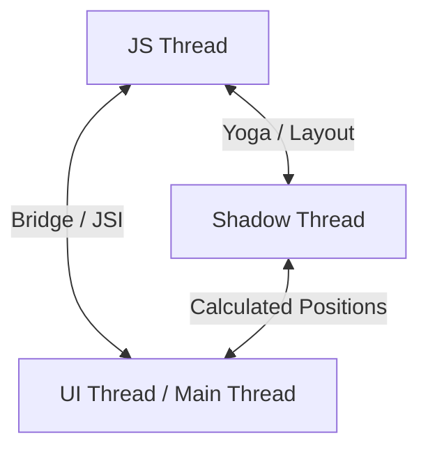

# JS Thread vs. UI Thread: Understanding the Bridge

In React Native, performance is directly tied to how work is distributed across multiple operating system threads and how they communicate. This guide details the core threads, the Bridge architecture, the New Architecture (JSI/Fabric/TurboModules), and strategies to prevent frame drops.

---

## 1. The Core Threads in React Native

A React Native application runs on three primary threads:



### 1. **JavaScript Thread (JS Thread)**
* **Purpose**: This is where your JavaScript engine (Hermes) executes.
* **Responsibilities**: Executes JavaScript business logic, handles API network requests, resolves React reconciliation, and triggers Redux state modifications.
* **Performance Impact**: If a function block takes longer than **16.67ms** (for a 60Hz screen) or **8.33ms** (for a 120Hz screen), it stalls the JS thread, causing interactive elements (like touch responsiveness or JS-driven animations) to feel laggy.

### 2. **Main Thread (UI Thread)**
* **Purpose**: The host operating system thread (Android's Main Thread / iOS's Main Queue).
* **Responsibilities**: Measures, draws, and renders native UI components, handles native animations, and receives gestures (touches, swipes).
* **Performance Impact**: Stalling this thread halts all rendering, causing the application to freeze completely.

### 3. **Shadow Thread (Layout Thread)**
* **Purpose**: A background C++ helper thread.
* **Responsibilities**: Processes layout instructions from React, calculates absolute node sizes and positions using the **Yoga** flexbox engine, and passes the calculated values to the UI Thread.

---

## 2. The Classic Bridge Architecture

In the classic React Native architecture, the JS thread and the Native (UI) thread are completely decoupled and communicate over **The Bridge**.

* **Bridge Rules**:
  1. **Asynchronous**: The JS thread sends a message and doesn't wait for a response; it is notified later.
  2. **Serialized**: Data is transformed into JSON strings, sent across the bridge, and deserialized on the other side.
  3. **Batched**: Calls are grouped together to minimize communication overhead.

### The Bottleneck
When an event (like a fast scroll or continuous gesture) occurs:
1. The UI Thread intercepts the swipe gesture.
2. It serializes the event data and sends it over the bridge to the JS Thread.
3. The JS Thread receives the message, parses the JSON, calculates the new position of elements, serializes the update, and sends it back.
4. The UI Thread receives the update, parses it, and renders the screen.

If the bridge is flooded with serialized data (e.g. during an animation), the queue backs up, resulting in **dropped frames** and lag.

---

## 3. The New Architecture: JSI, Fabric, and TurboModules

To solve the bridge bottleneck, React Native introduced the **New Architecture**, removing serialization entirely:

* **JSI (JavaScript Interface)**:
  A C++ interface that allows JavaScript to hold direct reference to Native C++ host objects. JS can call native methods *synchronously* and instantly, just like a regular JS function call.
* **Fabric**:
  The new rendering system built on top of JSI. Fabric handles layout and rendering directly in C++, enabling UI updates to be computed synchronously or asynchronously across threads without the bridge.
* **TurboModules**:
  The new native module system. Native modules are now loaded lazily when needed, reducing startup time and memory footprint.

---

## 4. Best Practices for Thread Optimization

### Use Native Animation Drivers
When using the React Native `Animated` API, always configure the native driver to move execution entirely to the UI thread:
```typescript
Animated.timing(animatedValue, {
  toValue: 1,
  duration: 300,
  useNativeDriver: true, // <-- Moves animation calculations from the JS Thread to the UI Thread
}).start();
```

### Use Worklets (`react-native-reanimated`)
Libraries like `react-native-reanimated` run animations and gesture handlers directly on a dedicated **UI Worklet Thread**, bypassing the JS thread:
```typescript
import { useSharedValue, useAnimatedStyle, withSpring } from 'react-native-reanimated';

const scale = useSharedValue(1);

// This style updates synchronously on the UI thread
const animatedStyle = useAnimatedStyle(() => {
  return {
    transform: [{ scale: withSpring(scale.value) }],
  };
});
```

### Keep the JS Thread Idle During Transitions
Avoid executing heavy network calculations or Redux updates during screen transitions. Use `InteractionManager` to delay actions:
```typescript
import { InteractionManager } from 'react-native';

InteractionManager.runAfterInteractions(() => {
  // Heavy computation or state changes run after transition completes
  fetchHeavyData();
});
```
