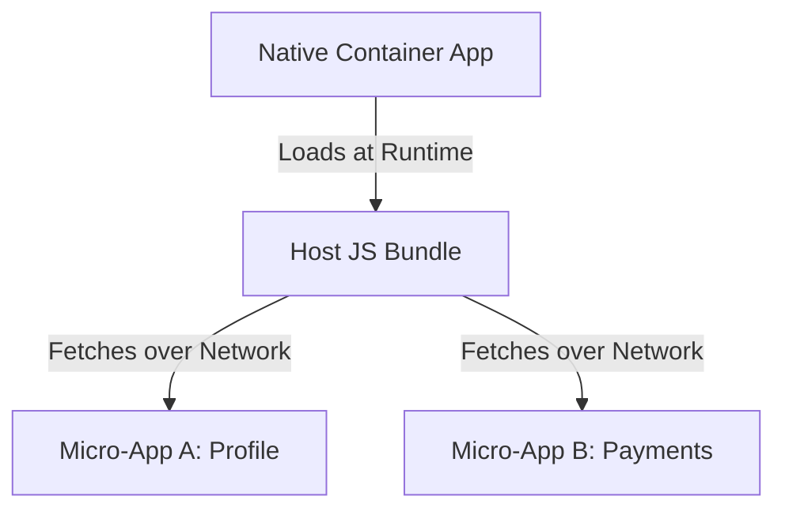

# React Native Micro-Frontend Architecture & Workspace Strategy

This document outlines the architectural analysis of **Micro-Frontend Architecture in React Native**, details why it was not implemented in this workspace, and explains how our **Nx Monorepo Modular Architecture** serves as the optimal production alternative.

---

## 1. What is Micro-Frontend Architecture in React Native?

In web development, micro-frontends allow different teams to build, deploy, and host parts of a website independently, combining them at runtime. In React Native, this is done using:
* **Re.Pack**: A Webpack-based bundler that replaces Metro.
* **Webpack Module Federation**: Allows the app to load JavaScript code blocks ("remotes") dynamically from external servers at runtime.



---

## 2. Why Micro-Frontends were NOT implemented in this Workspace

While micro-frontends sound appealing for huge enterprises, implementing them in this project introduces major stability, performance, and complexity risks:

1. **Incompatibility with Metro & Expo**: Expo is deeply integrated with the **Metro Bundler**. Moving to Webpack/Re.Pack breaks Expo modules, Expo Go, and standard EAS cloud build pipelines.
2. **Network Dependency & Latency**: Loading app screens dynamically over the network means users could experience white screen delays, loading states, or app crashes if they have a weak internet connection or are offline.
3. **App Store Review Policies**: Apple and Google have strict policies regarding updating core features without submitting a new binary review. Running unvetted remote code execution can lead to developer account bans.
4. **Maintenance Overhead**: Requires managing separate server deployments for each micro-app bundle, version synchronization, and complex routing bridges.

---

## 3. The Optimal Alternative: Compile-Time Monorepo

Instead of loading code over the network at **runtime**, we use an **Nx Monorepo** to separate code into independent modules at **compile-time**. This gives you clean team boundaries and code isolation without any native runtime risks.

### Workspace Folder Structure
Here is how our current modular monorepo workspace is structured to achieve clean separation:

```text
ReactNativeAppProduction/ (Workspace Root)
├── apps/
│   └── app/                        # Main Native App Shell
│       ├── android/                # Native Android Project
│       ├── ios/                    # Native iOS Project
│       ├── src/
│       │   └── shared/             # App-specific glue logic (Store, Navigation)
│       └── package.json
├── libs/
│   └── shared/                     # Scoped shared workspace libraries
│       ├── src/
│       │   ├── components/         # Reusable UI Atoms and Molecules
│       │   ├── context/            # Shared React Context providers
│       │   ├── hooks/              # Custom React Hooks Library
│       │   ├── services/           # Secure Storage, API Clients, Push Notifications
│       │   └── types/              # Type-safe TypeScript Interfaces
│       └── package.json
├── package.json                    # Root dependencies
└── tsconfig.base.json              # Scoped imports mapping (@app/shared/*)
```

---

## 4. Comparison: Runtime Micro-Frontends vs. Compile-time Monorepo

| Feature | Runtime Micro-Frontends (Re.Pack) | Compile-time Monorepo (Our Current Setup) |
| :--- | :--- | :--- |
| **Bundler** | Webpack (via Re.Pack) | Metro (Default & Fast) |
| **Code Split** | Runtime (Loaded over the network) | Compile-time (Bundled into final binary) |
| **Offline Support** | ❌ Complex (Requires local caching) | ✅ Native (Fully bundle-resident) |
| **Expo & EAS Integration** | ❌ Broken / Not supported | ✅ Native & Seamless |
| **Type Safety** | ❌ Hard to share TS types across repos | ✅ Seamless (TypeScript maps files locally) |
| **Deployment Risk** | ⚠️ High (Remote updates can crash app) |  Low (Fully tested before release) |
| **Best Suited For** | 50+ developers across multiple teams | 1-50 developers collaborating |
