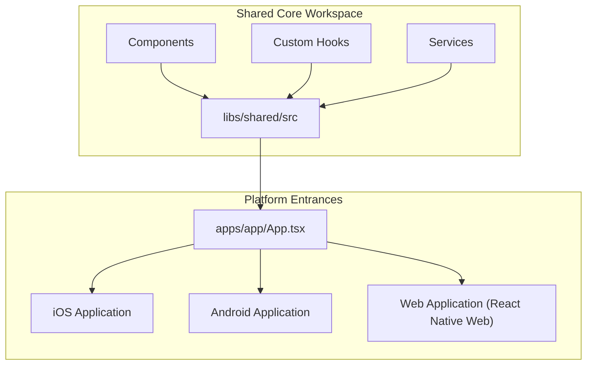

# Multi-Platform Code Sharing (React Native Web)

This document outlines the setup, architecture, and verification of multi-platform code sharing (React Native Web) in this workspace.

---

## 1. Current Implementation Status

Multi-platform code sharing is **fully implemented, configured, and verified** in this project. Using **Expo** and **React Native Web**, the codebase is compiled into:
* **iOS**: Native target (run via `npm run ios`)
* **Android**: Native target (run via `npm run android`)
* **Web**: Single Page Application (run via `npm run web`)

---

## 2. Architecture & Code Sharing Strategy

We achieve **up to 95% code reuse** using an Nx monorepo structure:



### Shared Layers
* **UI Components**: Layout elements, custom typography, form inputs, buttons, and stateful widgets under `libs/shared/src/components/`.
* **State Management**: Redux toolkit configuration, custom hooks, and shared global store slices.
* **Context Providers**: `ThemeContext` and dynamic light/dark theme tokens.
* **Services**: Mocking layers for non-compatible native modules on the web (e.g. secure keychain fallback to session storage).

---

## 3. How to Run and Bundling Commands

### Running Locally
To launch the Web browser version of the application:
```bash
npm run web
```
This boots Metro and automatically opens the application at `http://localhost:8081` in your browser.

### Verifying Build/Export Compilation
To generate optimized production bundles for all three targets (Web, iOS, and Android), run:
```bash
npx expo export
```
**Compilation Outputs:**
* `dist/index.html` (Entry point for Web)
* `dist/_expo/static/js/web/` (Optimized JS Web Bundle)
* `dist/_expo/static/js/ios/` (Hermes bytecode bundle for iOS)
* `dist/_expo/static/js/android/` (Hermes bytecode bundle for Android)

---

## 4. Key Cross-Platform Patterns in Use

1. **File Extension Swapping**:
   If a custom native integration (e.g. native permissions, device configuration) cannot run on browsers, we use extension-specific files:
   * `Feature.tsx` (Targeted for mobile)
   * `Feature.web.tsx` (Targeted for web)
   * Metro automatically imports the correct version during bundling.
2. **Dynamic Runtime Detection**:
   Using React Native's `Platform` API:
   ```typescript
   import { Platform } from 'react-native';
   
   const isBrowser = Platform.OS === 'web';
   ```
