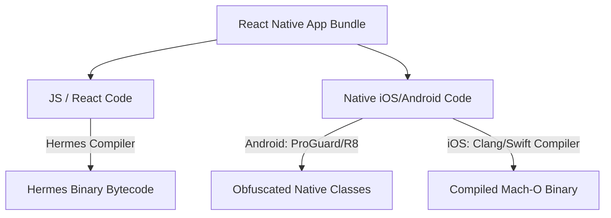

# Obfuscation and Code Protection Guide

This guide details the configurations, strategies, and best practices for securing our React Native application from reverse engineering, source-code extraction, and native tampering on iOS and Android.

---

## 1. Overview of Code Protection Layers

Securing a React Native application requires a defense-in-depth approach covering both the JavaScript layer (where business logic resides) and the platform-native wrapper layers:



---

## 2. JavaScript Layer: Hermes Bytecode Compilation

By default, standard React Native compiles JavaScript into a plaintext bundle file (`index.android.bundle` / `main.jsbundle`) stored inside the app bundle assets. This plaintext file is easily extracted and readable by anyone who downloads the `.apk` or `.ipa` package.

We prevent this by enabling the **Hermes Engine** in our builds:
* **Configuration**: Verified in [gradle.properties](file:///Users/ajay/Documents/ReactNativeAppProduction/apps/app/android/gradle.properties) (`hermesEnabled=true`) and Metro configurations.

### Security Benefits of Hermes:
* **Bytecode Compilation**: The Hermes compiler converts your JavaScript source code into binary bytecode (`.hbc`) during the release build.
* **Obfuscation**: Anyone attempting to extract your code will only see optimized binary bytecode instead of readable JavaScript code, making reverse engineering extremely difficult.
* **Performance Boosts**: Improves startup times, lowers memory footprint, and reduces download size.

---

## 3. Native Layer (Android): ProGuard & R8 Obfuscation

For Android applications, compiled Java/Kotlin source code can easily be decompiled back into highly readable Java classes using tools like **JADX**.

We prevent this by enabling **ProGuard/R8 minification and obfuscation**:

1. **Activation**: Enabled in [build.gradle](file:///Users/ajay/Documents/ReactNativeAppProduction/apps/app/android/app/build.gradle) by setting:
   ```groovy
   def enableProguardInReleaseBuilds = true
   ```
2. **How it Works**: 
   * **Minification**: Analyzes the class hierarchy and safely removes unused classes, fields, methods, and attributes.
   * **Obfuscation**: Renames remaining classes, fields, and methods using short, non-descriptive names (e.g. `MainController` becomes `a`, `fetchData()` becomes `b()`), scrambling the control flow.

### Customizing ProGuard Rules
If third-party native libraries crash or fail in release builds because of reflection or class name changes, add keep rules in [proguard-rules.pro](file:///Users/ajay/Documents/ReactNativeAppProduction/apps/app/android/app/proguard-rules.pro):
```proguard
# Keep react-native-config properties from being obfuscated/removed
-keep class com.lugg.ReactNativeConfig.** { *; }

# Keep native React Native bridge annotations intact
-keepattributes *Annotation*,Signature,InnerClasses,EnclosingMethod
-keepclassmembers class * {
  @com.facebook.react.bridge.ReactMethod *;
}
```

---

## 4. Secure Secrets Management

No client-side obfuscation or bytecode compilation is 100% impenetrable. Therefore, **never store private keys, databases passwords, or highly sensitive secrets directly in code.**

### Recommended Best Practices:
* **Use Environment Variables**: Dynamically compile values into the native layer using `react-native-config`.
* **Delegate to Backend Services**: Offload sensitive logic (e.g. executing payments, storing API keys for OpenAI/Stripe) to secure server-side API endpoints rather than doing them directly inside the mobile app.
* **Avoid Hardcoded Secrets**: Hardcoded strings inside the React Native JS files can still be extracted by memory inspection during app execution.

---

## 5. Advanced Code Protection (Optional Add-ons)

For enterprise-grade security requiring protection against active threats:

1. **Jailbreak / Root Detection**:
   Integrate a library like `react-native-jail-monkey` to detect if the device has been rooted (Android) or jailbroken (iOS). You can block sensitive features (like payments or authentication) if a compromised OS environment is detected.
2. **Integrate SSL Pinning**:
   Enforce SSL pinning (as described in our [Certificate Pinning Guide](file:///Users/ajay/Documents/ReactNativeAppProduction/documentation/certificate-pinning.md)) to prevent attackers from using debugging proxies (like Charles Proxy or Fiddler) to intercept network payloads.
