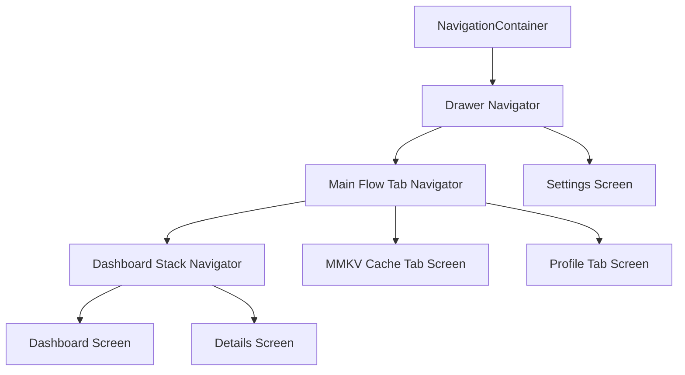

# React Navigation Setup Guide (Stack, Tabs, & Drawer)

This document provides step-by-step instructions for installing and configuring nested navigators (Stack, Bottom Tabs, and Drawer) in React Native, detailing package requirements, native links, and configuration files.

---

## 1. Installation

Install React Navigation core, specialized navigators, and their native peer dependencies:

```bash
# Core Navigation packages
npm install @react-navigation/native @react-navigation/native-stack @react-navigation/bottom-tabs @react-navigation/drawer

# Native peer dependencies (essential for screen performance and layout overlays)
npm install react-native-screens react-native-gesture-handler react-native-reanimated

# Required for React Native 0.85+ and Reanimated v4 (Shared Animation Backend)
npm install react-native-worklets
```

---

## 2. iOS Native Dependency Linking

After installing the packages, link the native C++, Objective-C, and Swift dependencies:

```bash
cd ios
pod install
```

---

## 3. Configuration Setup

### A. Babel Configuration (`babel.config.js`)
Add the `react-native-reanimated/plugin` to your plugins array. **Important**: The Reanimated plugin must be listed **last** in the plugins array.

```javascript
module.exports = {
  presets: ['module:@react-native/babel-preset'],
  plugins: ['react-native-reanimated/plugin'], // Must be at the end
};
```

### B. Metro Cache Reset
Babel plugins (like the Reanimated plugin) inject properties such as `.code` into worklets during transpilation. To apply the new plugins immediately and avoid `"Cannot read property 'code' of undefined"` errors, you must start Metro with a cache reset:

```bash
npx react-native start --reset-cache
```

### C. Entry Point Preparation (`index.js`)
To prevent gesture detection lifecycle crashes, prepend the gesture handler import at the very top of your entry file (before any other imports):

```javascript
import 'react-native-gesture-handler';
// ... other imports ...
```

---

## 4. Navigation Architecture (`src/navigation/index.tsx`)

A standard nested routing structure is configured inside [navigation/index.tsx](file:///Users/ajay/Documents/ReactNativeAppProduction/src/navigation/index.tsx):



### Setup Implementation Steps:
1. Wrap the entire app root layout with `<GestureHandlerRootView style={{ flex: 1 }}>` and `<SafeAreaProvider>`.
2. Wrap your routing entry point with `<NavigationContainer>`.
3. Build the **Stack Navigator** containing detail paths.
4. Nest the Stack Navigator inside the **Bottom Tabs Navigator** tabs alongside other core tabs (e.g., MMKV Cache, Profile).
5. Nest the Bottom Tabs Navigator inside the **Drawer Navigator** side menu (collapsible pane).
